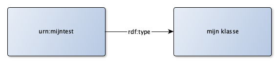
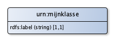

# rdf2graphml
Java converter to visualize RDF data, using the Graphml markup language.

## Introduction

[GraphML](http://graphml.graphdrawing.org) is an XML language that is used to specifiy graph visualizations. As such, it contains the basic elements that you need to visualize RDF data and RDF models. As it can be extended, it is also possible to describe more specific structures that might be needed.

The advantage of GraphML over other graphical markup languages (such as SVG), is the focus on graphs and the separation of the graph model from the spatial properties of a diagram (such as X-Y positioning). This makes it possible to generate a GraphML file, without the need to plot the elements at a certain location. Because tools (like [yEd](https://www.yworks.com/products/yed)) exists for GraphML that can be used to manipulate the position of graph elements and to use graph layout algorithms, the conversion can focus on the transformation, without the need to handle manipulation and layout concerns.

Any RDF serialization (for example: Turtle, JSON-LD, RDF/XML) can be used as input. The converter uses Apache Jena to transform the original serialization to RDF/XML.

The transformation itself is performed by the Saxon XSL engine. XML stylesheets are a very common and broadly used approach to transform (XML) data structures to other (XML) data structures. In this case: the transformation of a RDF/XML file to a GraphML (XML) file.

## Usage

```
java -jar rdf2graphml -d <RDF-input-file> <GraphML-output-file>
java -jar rdf2graphml -m <RDF-input-file> <GraphML-output-file>
```

The first usage will create a GraphML visualization of the actual data (a graph structure from the triples). The second usage will create a GraphML visualization of a RDFS/OWL/SHACL model, resembling the way a UML or ERD data model is presented.

## Examples

### Data example


This example is taken from the graphml file generated from the [data.ttl](data/data.ttl) file as input.

### Model example


This example is taken from the graphml file generated from the [model.ttl](data/model.ttl) file as input.

## Building the converter yourself

The convert is build in Java, using Maven. Prerequisites are the installation of the Java JDK and Maven.

```
mvn clean package
```
